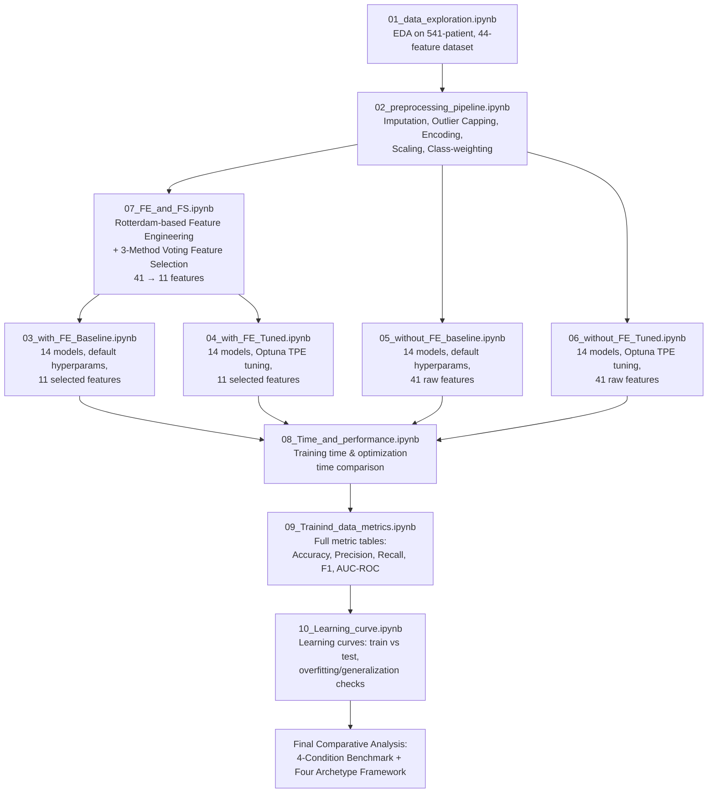
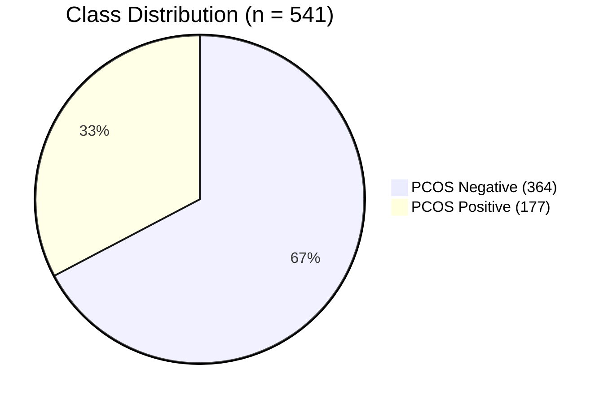
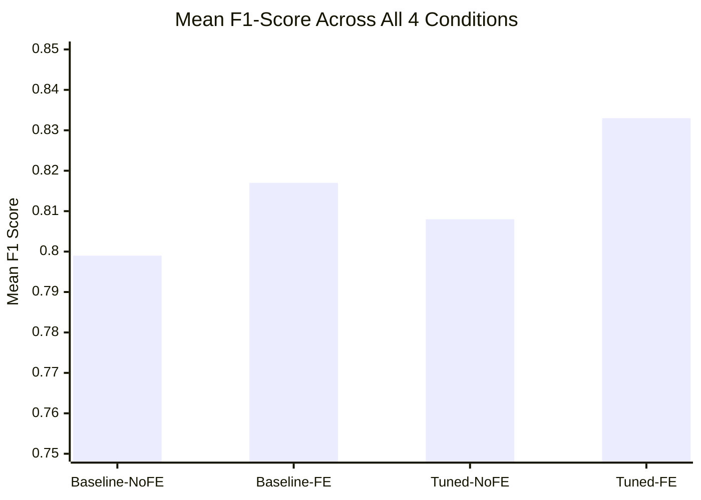
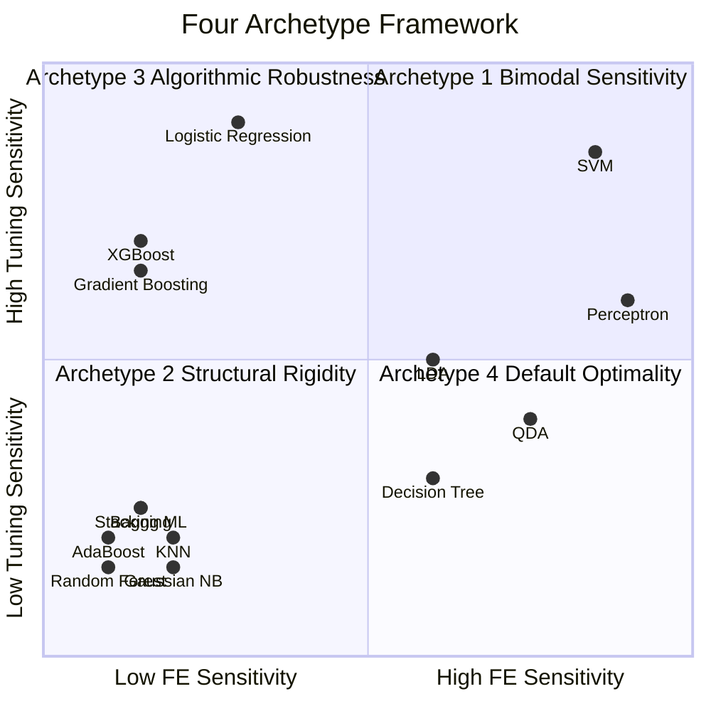

# 🩺 PCOS Classification Using Machine Learning

**A Systematic Study of Feature Engineering, Feature Selection, and Bayesian Hyperparameter Optimization for Polycystic Ovary Syndrome (PCOS) Prediction**


---

## 📌 Overview

Polycystic Ovary Syndrome (**PCOS**) is the most common endocrine disorder in women of reproductive age, affecting **8–20%** of this population worldwide. Delayed or missed diagnosis is linked to infertility, type 2 diabetes, and cardiovascular disease.

This repository documents an end-to-end ML pipeline for PCOS prediction on a **541-patient clinical dataset (41 raw features)**, evaluating **14 classifiers across 9 algorithm families** under **4 experimental conditions**: Baseline vs. Bayesian-Tuned, each With vs. Without Feature Engineering.

---

## 🗂️ Notebook Pipeline (Actual Execution Order)

This is the real, end-to-end workflow exactly as implemented in `/notebooks`:



| Notebook | Purpose |
|---|---|
| `01_data_exploration.ipynb` | Exploratory Data Analysis — class balance, distributions, missing values, correlations |
| `02_preprocessing_pipeline.ipynb` | Unified cleaning pipeline: imputation, outlier capping, encoding, scaling, class weighting |
| `03_with_FE_Baseline.ipynb` | 14 classifiers, **default hyperparameters**, **11 engineered/selected features** |
| `04_with_FE_Tuned.ipynb` | 14 classifiers, **Optuna Bayesian tuning**, **11 engineered/selected features** |
| `05_without_FE_baseline.ipynb` | 14 classifiers, **default hyperparameters**, **41 raw features** |
| `06_without_FE_Tuned.ipynb` | 14 classifiers, **Optuna Bayesian tuning**, **41 raw features** |
| `07_FE_and_FS.ipynb` | Rotterdam-criteria feature engineering (7 new features) + 3-method voting feature selection (41 → 11) |
| `08_Time_and_performance.ipynb` | Training/optimization time benchmarking across all 4 conditions |
| `09_Trainind_data_metrics.ipynb` | Consolidated metrics tables for all 14 models × 4 conditions |
| `10_Learning_curve.ipynb` | Learning curve analysis — training data size vs. F1/AUC-ROC, overfitting diagnostics |

---

## 🎯 Key Highlights

| Aspect | Detail |
|---|---|
| Dataset size | 541 patients (364 negative, 177 positive) — 67.3% / 32.7% class split |
| **Raw features** | **41** clinical, hormonal, anthropometric & ultrasound variables |
| Engineered features | 7 clinically derived (Rotterdam-based) |
| Final selected features | 11 (10 raw + 1 engineered, via 3-method voting) |
| EPV improvement | 4.31 → 16.09 (satisfies EPV ≥ 10 clinical validity threshold) |
| Models evaluated | 14 classifiers across 9 algorithm families |
| Cross-validation | Stratified 10-fold |
| **Best Baseline Model** | AdaBoost (F1 = 0.845, with FE) |
| **Best Baseline Recall** | Logistic Regression (Recall = 88.7%, with FE) |
| **Best Tuned Model** | SVM (RBF kernel) — F1 = 0.8807, Recall = 90.6% |
| **Best Calibrated Model** | Logistic Regression — Brier Score = 0.069 |

---

## 📁 Repository Structure

PCOS_Classification_Using_Machine_Learning/
│
├── data/ # Raw and processed datasets
├── models/ # Saved trained model artifacts (.pkl)
├── notebooks/
│ ├── 01_data_exploration.ipynb
│ ├── 02_preprocessing_pipeline.ipynb
│ ├── 03_with_FE_Baseline.ipynb
│ ├── 04_with_FE_Tuned.ipynb
│ ├── 05_without_FE_baseline.ipynb
│ ├── 06_without_FE_Tuned.ipynb
│ ├── 07_FE_and_FS.ipynb
│ ├── 08_Time_and_performance.ipynb
│ ├── 09_Trainind_data_metrics.ipynb
│ └── 10_Learning_curve.ipynb
├── requirements.txt
├── .gitignore
└── README.md


---

## 🧬 Dataset Description

- **Source:** Publicly available PCOS clinical dataset (Kaggle)
- **Patients:** 541 total (177 PCOS-positive, 364 PCOS-negative)
- **Raw features:** 41, spanning:
  - Demographic (age)
  - Anthropometric (BMI, weight, height, waist/hip ratio)
  - Hormonal (LH, FSH, AMH, TSH, PRL, testosterone, etc.)
  - Metabolic (fasting insulin, blood glucose)
  - Menstrual history (cycle length, cycle regularity)
  - Ultrasound findings (follicle count left/right, endometrial thickness)
  - Lifestyle/behavioral (smoking, alcohol use)

### Class Distribution



---

## ⚙️ Data Pre-processing Pipeline (Notebook 02)

Applied identically across **all four experimental conditions** to ensure fair comparison:

1. **Missing values:** Median imputation (continuous), Mode imputation (categorical)
2. **Outliers:** IQR-based capping at 1.5× IQR boundaries
3. **Categorical encoding:** One-hot encoding (sklearn conventions)
4. **Scaling:** Standardization (zero mean, unit variance)
5. **Class imbalance:** `class_weight="balanced"` + Stratified 10-fold CV (SMOTE intentionally avoided — moderate 2:1 imbalance + leakage risk)

---

## 🧪 Feature Engineering & Selection (Notebook 07)

### Rotterdam-Criteria-Based Engineered Features

Per the **Rotterdam diagnostic criteria** (2 of 3: oligo-anovulation, hyperandrogenism, polycystic ovarian morphology), **7 clinically-derived features** were engineered from the 41 raw variables:

| # | Engineered Feature | Clinical Rationale |
|---|---|---|
| 1 | **LH/FSH Ratio** | Elevated ratio is a known PCOS hormonal biomarker |
| 2 | **AMH × BMI (interaction)** | Joint ovarian reserve + metabolic status signal |
| 3 | **Follicle Asymmetry** | \|Left − Right\| follicle count captures unilateral dysregulation |
| 4 | **Cycle Regularity Indicator** | Encodes Rotterdam's oligo-anovulation criterion |
| 5 | **Hyperandrogenism Composite** | Weighted androgen marker combination |
| 6 | **Insulin Resistance Proxy** | Fasting insulin × fasting glucose (HOMA-IR style) |
| 7 | **Endometrial Thickness / Cycle Length Ratio** | Reproducibility across menstrual phases |

### 3-Method Voting Feature Selection

A feature was retained only if selected by **≥ 2 of 3** independent statistical tests:

1. Pearson/Spearman correlation with target (p < 0.05)
2. Chi-square test of association
3. Mutual information threshold

**Result:** Of the 41 raw + 7 engineered candidates, only **Follicle Asymmetry** passed among the engineered set (the other 6 were redundant with raw features already selected). Final feature set = **10 raw + 1 engineered = 11 predictors**.

### Events-Per-Variable (EPV) Justification

$$
EPV_{raw} = \frac{177}{41} = 4.31 \quad (\text{below clinical minimum of } 10)
$$
$$
EPV_{engineered} = \frac{177}{11} = 16.09 \quad (\text{satisfies EPV} \geq 10)
$$

Reducing dimensionality is therefore not just a performance optimization — it is a **statistical validity requirement** for parametric models on this cohort.

---

## 🤖 Models Evaluated (14 Classifiers, 9 Families)

| Family | Models |
|---|---|
| Linear | Logistic Regression, Perceptron |
| Kernel | Support Vector Machine (SVM) |
| Probabilistic | Gaussian Naïve Bayes, QDA |
| Discriminant | LDA |
| Tree-based | Decision Tree, Random Forest |
| Boosting | AdaBoost, XGBoost, Gradient Boosting |
| Bagging | Bagging Classifier |
| Meta-learner | Stacking ML |
| Instance-based | K-Nearest Neighbors (KNN) |

---

# 📊 PIPELINE 1: Baseline Models (Default Hyperparameters)

## 1a. Baseline — WITHOUT Feature Engineering (41 raw features)
*(Notebook 05: `05_without_FE_baseline.ipynb`)*

| Model | Family | Accuracy | Precision | Recall | F1-Score | AUC-ROC |
|---|---|---|---|---|---|---|
| **AdaBoost** | Boosting | 0.8957 | 0.8600 | 0.8113 | **0.8350** | 0.9487 |
| LDA | Discriminant | 0.8834 | 0.7931 | 0.8679 | 0.8288 | 0.9492 |
| XGBoost | Boosting | 0.8773 | 0.7895 | 0.8491 | 0.8182 | 0.9470 |
| Bagging Classifier | Bagging | 0.8773 | 0.7895 | 0.8491 | 0.8182 | 0.9324 |
| Stacking ML | Meta-learner | 0.8834 | 0.8400 | 0.7925 | 0.8155 | 0.9494 |
| Random Forest | Tree | 0.8650 | 0.7385 | 0.9057 | 0.8136 | 0.9483 |
| KNN | Instance-based | 0.8650 | 0.8298 | 0.7358 | 0.7800 | 0.9322 |
| Decision Tree | Tree | 0.8650 | 0.7818 | 0.8113 | 0.7963 | 0.8511 |
| Gradient Boosting | Boosting | 0.8528 | 0.7458 | 0.8302 | 0.7857 | 0.9453 |
| Logistic Regression | Linear | 0.8650 | 0.8163 | 0.7547 | 0.7843 | 0.9365 |
| Perceptron | Linear | 0.8589 | 0.7885 | 0.7736 | 0.7810 | 0.9190 |
| SVM | Kernel | 0.8650 | 0.8605 | 0.6981 | 0.7708 | 0.9352 |
| Gaussian Naïve Bayes | Probabilistic | 0.8098 | 0.6667 | 0.8302 | 0.7395 | 0.8814 |
| QDA | Probabilistic | 0.8221 | 0.7609 | 0.6604 | 0.7071 | 0.8590 |

**Mean F1 (Baseline, Without FE): 0.799**

**AdaBoost Confusion Matrix** — Accuracy 89.57%, Sensitivity 81.13%, Specificity 93.64%, AUC 0.9487

| | Predicted: No | Predicted: Yes |
|---|---|---|
| **Actual: No** | 103 | 7 |
| **Actual: Yes** | 10 | 43 |

``
``

---

## 1b. Baseline — WITH Feature Engineering (11 selected features)
*(Notebook 03: `03_with_FE_Baseline.ipynb`)*

| Model | Family | Accuracy | Precision | Recall | F1-Score | AUC-ROC |
|---|---|---|---|---|---|---|
| **AdaBoost** | Boosting | 0.9080 | **0.9318** | 0.7736 | 0.8454 | 0.9475 |
| **Logistic Regression** | Linear | 0.9080 | 0.8393 | **0.8868** | **0.8624** | 0.9492 |
| Gaussian Naïve Bayes | Probabilistic | 0.9018 | 0.8776 | 0.8113 | 0.8431 | **0.9513** |
| Perceptron | Linear | 0.8957 | 0.8750 | 0.7925 | 0.8317 | 0.9288 |
| LDA | Discriminant | 0.8896 | 0.8571 | 0.7925 | 0.8235 | 0.9461 |
| KNN | Instance-based | 0.8896 | 0.9268 | 0.7170 | 0.8085 | 0.9354 |
| XGBoost | Boosting | 0.8834 | 0.8148 | 0.8302 | 0.8224 | 0.9468 |
| Stacking ML | Meta-learner | 0.8834 | 0.8400 | 0.7925 | 0.8155 | 0.9472 |
| QDA | Probabilistic | 0.8834 | 0.8148 | 0.8302 | 0.8224 | 0.9427 |
| SVM | Kernel | 0.8773 | 0.8000 | 0.8302 | 0.8148 | 0.9441 |
| Bagging Classifier | Bagging | 0.8650 | 0.7627 | 0.8491 | 0.8036 | 0.9435 |
| Gradient Boosting | Boosting | 0.8650 | 0.7627 | 0.8491 | 0.8036 | 0.9419 |
| Random Forest | Tree | 0.8589 | 0.7500 | 0.8491 | 0.7965 | 0.9477 |
| Decision Tree | Tree | 0.8466 | 0.7414 | 0.8113 | 0.7748 | 0.8375 |

**Mean F1 (Baseline, With FE): 0.817** → **+2.3% absolute improvement over 1a**

**Logistic Regression Confusion Matrix** — Accuracy 90.80%, Sensitivity 88.68%, Specificity 91.82%, AUC 0.9365

| | Predicted: No | Predicted: Yes |
|---|---|---|
| **Actual: No** | 101 | 9 |
| **Actual: Yes** | 6 | 47 |

**AdaBoost Confusion Matrix** — Accuracy 90.80%, Precision 93.18% (highest), AUC 0.9487

| | Predicted: No | Predicted: Yes |
|---|---|---|
| **Actual: No** | 107 | 3 |
| **Actual: Yes** | 12 | 41 |

``
``

### 🔑 Pipeline 1 Takeaway
- **AdaBoost** → best precision & overall F1 without FE; stays strong with FE.
- **Logistic Regression** → biggest beneficiary of FE, becomes the best **recall/screening** model (88.7%).
- Probabilistic models (Gaussian NB, QDA) were weakest without FE — confirming sensitivity to raw multicollinearity.

---

# 📊 PIPELINE 2: Tuned Models (Bayesian Optimization — Optuna TPE)

All 14 classifiers optimized using **Optuna's Tree-structured Parzen Estimator (TPE)**, 100 trials/model, optimizing stratified 10-fold CV F1-score.

## 2a. Tuned — WITHOUT Feature Engineering (41 raw features)
*(Notebook 06: `06_without_FE_Tuned.ipynb`)*

| Model | Accuracy | Precision | Recall | F1 | AUC-ROC |
|---|---|---|---|---|---|
| AdaBoost | 0.8834 | 0.8036 | 0.8491 | 0.8257 | 0.9400 |
| LDA | 0.8834 | 0.8036 | 0.8491 | 0.8257 | 0.9561 |
| XGBoost | 0.8957 | 0.8333 | 0.8491 | 0.8411 | 0.9427 |
| Bagging | 0.8896 | 0.8182 | 0.8491 | 0.8333 | 0.9427 |
| Stacking ML | 0.9080 | 0.8958 | 0.8113 | 0.8515 | **0.9580** |
| Random Forest | 0.8896 | 0.8302 | 0.8302 | 0.8302 | 0.9396 |
| KNN | 0.7975 | 0.6351 | 0.8868 | 0.7402 | 0.9126 |
| Decision Tree | 0.8037 | 0.6780 | 0.7547 | 0.7143 | 0.8460 |
| Gradient Boosting | 0.8896 | 0.8302 | 0.8302 | 0.8302 | 0.9451 |
| **Logistic Regression** | 0.9202 | **0.9762** | 0.7736 | **0.8632** | 0.9612 |
| Perceptron | 0.8405 | 0.7547 | 0.7547 | 0.7547 | 0.9331 |
| SVM | 0.8712 | 0.7963 | 0.8113 | 0.8037 | 0.9501 |
| Gaussian Naïve Bayes | 0.8037 | 0.6364 | 0.9245 | 0.7538 | 0.8789 |
| QDA | 0.8466 | 0.7500 | 0.7925 | 0.7706 | 0.9038 |

**Logistic Regression Confusion Matrix** — highest precision (97.6%) via L1-induced sparsity acting like implicit feature selection

| | Predicted: No | Predicted: Yes |
|---|---|---|
| **Actual: No** | 109 | 1 |
| **Actual: Yes** | 12 | 41 |

``
``

---

## 2b. Tuned — WITH Feature Engineering (11 selected features)
*(Notebook 04: `04_with_FE_Tuned.ipynb`)*

| Model | Accuracy | Precision | Recall | F1 | AUC-ROC |
|---|---|---|---|---|---|
| AdaBoost | 0.8834 | 0.8400 | 0.7925 | 0.8155 | 0.9504 |
| LDA | 0.9080 | 0.8519 | 0.8679 | 0.8598 | 0.9504 |
| XGBoost | 0.9080 | 0.8800 | 0.8302 | 0.8544 | 0.9544 |
| Bagging | 0.8896 | 0.8302 | 0.8302 | 0.8302 | 0.9499 |
| Stacking ML | 0.9018 | **0.9111** | 0.7736 | 0.8367 | 0.9561 |
| Random Forest | 0.8712 | 0.8077 | 0.7925 | 0.8000 | 0.9463 |
| KNN | 0.8589 | 0.8261 | 0.7170 | 0.7677 | 0.9357 |
| Decision Tree | 0.8650 | 0.7818 | 0.8113 | 0.7963 | 0.9101 |
| Gradient Boosting | 0.9018 | 0.8776 | 0.8113 | 0.8431 | 0.9528 |
| Logistic Regression | 0.9202 | 0.9167 | 0.8302 | 0.8713 | 0.9540 |
| Perceptron | 0.9202 | 0.9000 | 0.8491 | 0.8738 | 0.9532 |
| **SVM (RBF)** | **0.9202** | 0.8571 | **0.9057** | **0.8807** | 0.9492 |
| Gaussian Naïve Bayes | 0.8773 | 0.9231 | 0.6792 | 0.7826 | 0.9516 |
| QDA | 0.9018 | 0.8491 | 0.8491 | 0.8491 | 0.9475 |

**SVM Confusion Matrix** — **Best overall model** — Accuracy 92.0%, Recall 90.6%, AUC 0.9492

| | Predicted: No | Predicted: Yes |
|---|---|---|
| **Actual: No** | 102 | 8 |
| **Actual: Yes** | 5 | 48 |

``
``

### 🔑 Pipeline 2 Takeaway
- **Without FE:** Logistic Regression dominates (F1 = 0.8632) — L1 penalty (C=0.111) internally mimics feature selection on the 41-feature space.
- **With FE:** SVM (RBF kernel) becomes best overall (F1 = 0.8807) — Bayesian tuning switches its kernel from linear → RBF once dimensionality drops to 11, capturing non-linear hormonal interactions.
- **Mean F1: 0.808 (without FE) → 0.833 (with FE)**, a **+0.031** gain. Individual gains vary from +0.1191 (Perceptron) to −0.0302 (Random Forest).

---

## 📈 4-Condition Comparison Summary

| Pipeline | Condition | Mean F1 (14 models) | Best Model | Best F1 | Best Recall |
|---|---|---|---|---|---|
| 1. Baseline | Without FE | 0.799 | AdaBoost | 0.835 | Random Forest (0.906) |
| 1. Baseline | With FE | 0.817 | AdaBoost | 0.845 | Logistic Regression (0.887) |
| 2. Tuned | Without FE | 0.808 | Logistic Regression | 0.863 | Gaussian NB (0.925) |
| 2. Tuned | With FE | 0.833 | **SVM (RBF)** | **0.881** | **SVM (0.906)** |



---

## ⏱️ Training Time & Optimization Cost (Notebook 08)

Reducing the feature space from 41 → 11 substantially cut computational cost during Bayesian hyperparameter search:

| Model | Optimization Time (Without FE, 41 features) | Optimization Time (With FE, 11 features) | Reduction |
|---|---|---|---|
| AdaBoost | 3938 sec | 2169 sec | **−45%** |
| Random Forest | High | Reduced | **−66%** |
| Bagging Classifier | High | Reduced | **−27%** |
| SVM | Low (best F1/time tradeoff) | Fastest, highest F1 (0.8807) | Best overall efficiency |

**Key finding:** Feature engineering doesn't just improve accuracy — it makes the **entire Bayesian AutoML search meaningfully cheaper**, since matrix operations (kernel calculations in SVM, covariance estimation in LDA/QDA, split-finding in trees) scale with feature count. SVM had the best F1-to-training-time tradeoff, reaching the top F1-score of 0.8807 in a matter of seconds, while tree-based ensembles required significantly longer training times.

``

---

## 📉 Learning Curve Analysis (Notebook 10)

Learning curves were plotted for all 14 classifiers to evaluate overfitting and generalization as training data size increased (10% → 100%).

**Key findings:**

| Observation | Detail |
|---|---|
| **Convergence** | Most classifiers (Logistic Regression, Gaussian NB, SVM, boosting ensembles) converged to a stable ~0.95 ROC-AUC beyond 50–60% of training data, with minimal overfitting |
| **Decision Tree overfitting** | Training performance stuck at 1.00 F1/AUC, while test performance plateaued at only 0.76–0.86 — a clear overfitting signature, reinforcing why ensemble methods (Random Forest, Bagging, Boosting) are preferred over single trees |
| **AdaBoost: FE vs No-FE stability** | Non-FE AdaBoost was *more stable* at full training data (F1 = 0.8257, AUC = 0.9400) vs. the FE-tuned version (F1 = 0.8155, AUC = 0.9504) — for lower training fractions (10–30%) the gap between the two shrank, suggesting FE mainly benefits **consistency/stability of results**, not necessarily peak (asymptotic) performance |
| **Data sufficiency** | None of the 14 classifiers had clearly plateaued — the learning curves suggest an estimated **~248 additional patients (45.8% more data)** would likely be needed to reach a true performance plateau for most models |

``
``
``

---

## 🧩 The Four Archetype Framework

Derived by comparing model behavior across all 4 conditions (Baseline/Tuned × With/Without FE):

| Archetype | Models | Description |
|---|---|---|
| **1. Bimodal Sensitivity** | SVM, Perceptron, LDA, QDA, Decision Tree | Strongly benefit from **both** FE and tuning — FE resolves dimensionality/collinearity issues (e.g., QDA's covariance matrix drops from ~1,681 to ~121 parameter estimates), tuning then unlocks discriminative power |
| **2. Structural Rigidity** | Gaussian Naïve Bayes, KNN | Modest FE gains; Bayesian tuning often *underperforms* defaults — small search space, prone to overfitting |
| **3. Algorithmic Robustness** | XGBoost, Gradient Boosting | Built-in regularization (L1/L2, subsampling) makes them largely insensitive to FE; they respond mainly to tuning |
| **4. Default Optimality** | AdaBoost, Random Forest, Bagging, Stacking ML | Internal per-node/per-estimator feature selection makes external FE largely redundant; sometimes FE + tuning combined can even slightly hurt (e.g., Stacking ML AUC drops from 0.9580 → 0.9561) |



---

## 🔍 Explainability & Diagnostics

Applied to the best-performing tuned models to move beyond black-box classification:

| Tool | Purpose |
|---|---|
| **SHAP** | Global feature importance — top predictors: Follicle No. (R/L), Hair growth, Weight gain, Skin darkening, AMH, Follicle Asymmetry |
| **LIME** | Per-patient local explanation of individual predictions |
| **Calibration Curves** | Logistic Regression best calibrated (Brier Score = 0.069) |
| **Decision Curve Analysis (DCA)** | Clinical net benefit across probability thresholds |
| **Precision-Recall Curves** | Performance evaluation under class imbalance |

---

## 📐 Evaluation Metrics

| Metric | Definition |
|---|---|
| Accuracy | Proportion of correctly classified instances |
| Precision | TP / (TP + FP) |
| Recall (Sensitivity) | TP / (TP + FN) — clinically prioritized, since false negatives are costly |
| F1-Score | Harmonic mean of Precision & Recall |
| AUC-ROC | Threshold-independent discriminative measure |
| Brier Score | Calibration quality of predicted probabilities |

---

## 🚀 Getting Started

```bash
git clone https://github.com/hariniisathappan/PCOS_Classification_Using_Machine_Learning.git
cd PCOS_Classification_Using_Machine_Learning
pip install -r requirements.txt
```

Run notebooks in this order for full reproducibility:

```bash
01_data_exploration.ipynb
02_preprocessing_pipeline.ipynb
07_FE_and_FS.ipynb
03_with_FE_Baseline.ipynb
04_with_FE_Tuned.ipynb
05_without_FE_baseline.ipynb
06_without_FE_Tuned.ipynb
08_Time_and_performance.ipynb
09_Trainind_data_metrics.ipynb
10_Learning_curve.ipynb


---

## 🧠 Conclusion

- Rotterdam-criteria-based **Feature Engineering** improves mean F1 across both baseline (+2.3%) and tuned (+3.1%) pipelines, while raising the **EPV ratio from 4.31 to 16.09**, satisfying statistical validity requirements for parametric modelling.
- **AdaBoost** is the strongest baseline (default) model; **SVM (RBF)** is the strongest model once Bayesian-tuned with engineered features.
- **Logistic Regression** is remarkably consistent across all four conditions and offers the best-calibrated probability outputs (Brier = 0.069), ideal for clinical risk scoring.
- Feature engineering also reduces **training/optimization time by up to 66%** for some models, since matrix operations scale with feature count.
- Learning curves show that **most models have not yet plateaued** — more clinical data (~46% more patients) would likely improve robustness further.
- The **Four Archetype Framework** explains *why* some models need FE + tuning together, while others are largely self-sufficient.

---

## 👩‍💻 Author

**Harini S** — Division of Bioinformatics, SASTRA Deemed University, Thanjavur

---

## 📄 License

This project is licensed under the MIT License.
